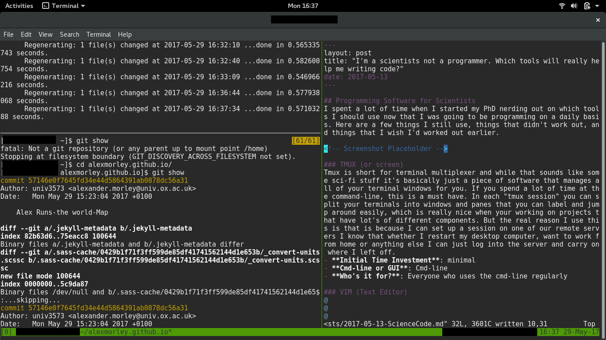

## Programming Software for Scientists
I spent a lot of time when I started my PhD nerding out on which tools I should use now that I was going to be programming on a daily basis. Here are a few things I still use, things that didn't work out, and things that I wish I'd worked out earlier.

Oh and just to show that I really do use these tools for just about everything I do now: here's a screenshot of me writing this post.

### TMUX (or screen)
Tmux is short for terminal multiplexer and while that sounds like some sci-fi stuff it's basically just a piece of software that manages all of your terminal windows for you. If you spend a lot of time at the command-line, this is a must have. In each "tmux session" you can split your terminals into windows and panes that you can label and jump around easily, which is really nice when your working on projects that have lot's of different components. But the real reason I use this is that is because I can set up a session on one of our remote servers I know that whether I restart my desktop computer, want to work from home or anything else I can just log into the server and carry on where I left off.
- **Initial Time Investment**: minimal
- **Cmd-line or GUI**: Cmd-line
- **Who's it for?**: Everyone who uses the cmd-line regularly

### VIM (Text Editor)
I'm not going to go into this one alot because you can just google "text editor for programming" and read all the (sometimes heated) arguments about which ones best over there. What I will say is that it is a good idea to actually choose a text-editor, rather than sticking with nano or whatever came installed on your computer. If your going to write code then something with syntax highlighting is a minimal requirement.
- **Initial Time Investment**: some -vim has a bit of steep learning curve
- **Cmd-line or GUI**: Both
- **Who's it for?**: people who value not having to move their fingers very far.
- **Other options**: Emacs, atom, gedit

### Git & Github (Version Control & Code Sharing)
Version control is one of those things that once you've been using it for a while, you'll wonder how you ever worked without it. The building blocks of git, repositories, branches and commits all allow you to keep the changes that you make to your code entirely modular. This is really essential for collaberating on big projects, but has also often saved me hours & hours if I need to go and undo one specific change that I made a few months ago, or if I want to try things out without danger of breaking anything else. I also find its the only way I can keep my thoughts in order about any project that has more than a couple of aspects. One final reason that you should probably try and get to grips with these types of things soon is that more and more journals will require code-deposition and familiarity with git/github can make this way less painful.

Convinced? Already wanted to try but not sure where to start? My two top tips are 1) use a graphical interface to start with, even if you are comfortable on the command line. If you can visualise what the different commands for git are doing you will master it much faster, otherwise, for me at least, everything remains too abstract. 2) Go through a full tutorial or guide, my favourite being Software Carpentry's [git-novice](https://swcarpentry.github.io/git-novice).
- **Initial Time Investment**: easy to get started & for it to be useful. Years to master.
- **Cmd-line or GUI**: Both
- **Who's it for?**: Everyone who programs as part of their reserach.
- **Other options**: Mercurial & Bitbucket
